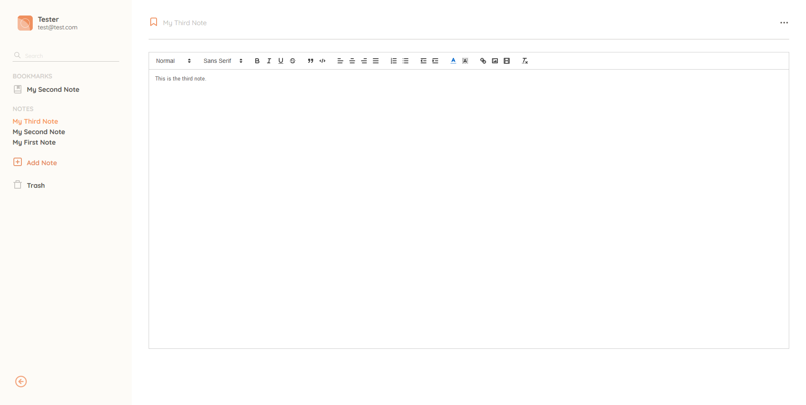

# Notatniku

Notatniku is a simple notebook web application, you can write/delete/bookmark, convert images to text, and export notes to .txt files.

You can view the live app at [Notatniku](https://notatniku.web.app).

## Available Scripts

### Install the dependencies
```
yarn install
```

### Compiles and hot-reloads for development
```
yarn serve
```

Runs the app in the development mode and starts up the local server.

Open [http://localhost:8080](http://localhost:8080) to view it in the browser.

## Technologies
Project is created with:
* Vue.js
* Node.js
* Express
* Google Cloud Vision
* Google Cloud Storage
* Firebase
* SCSS

## Screenshot of the app
